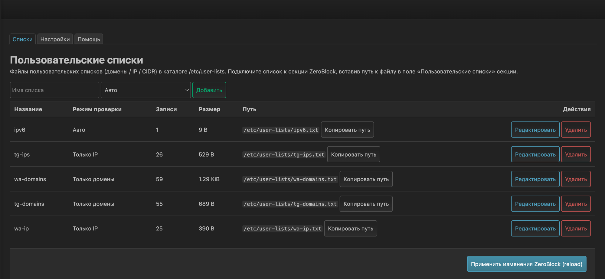
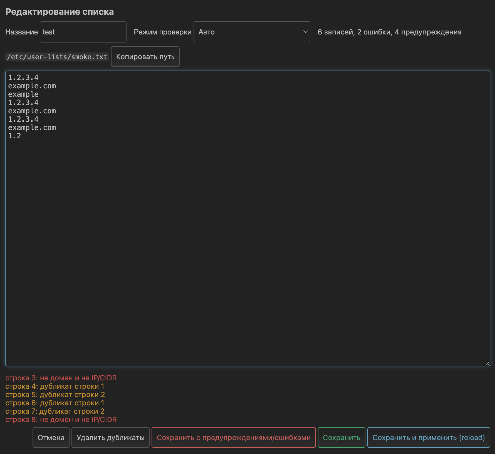

# luci-app-routelists

[](https://github.com/a1d4r/luci-app-routelists/actions/workflows/ci.yml)
[](https://github.com/a1d4r/luci-app-routelists/releases)
[](LICENSE)

LuCI-приложение для OpenWrt: пользовательские списки (домены / IP / CIDR) для [ZeroBlock](https://zeroblock.dev) как самостоятельная сущность — создание, редактирование, валидация и обзор в веб-интерфейсе, без SSH.

*A LuCI app for managing user list files (domains / IP / CIDR) for ZeroBlock — create, edit and validate lists right in the web UI.*

## Зачем

ZeroBlock умеет подключать списки из файлов (поле «Пользовательские списки» в секции), но не даёт их вести: файлы создаются и правятся только по SSH. Это приложение добавляет в LuCI раздел **Службы → Пользовательские списки**, где все списки видны, редактируются и проверяются. Валидация особенно важна: автодетект ZeroBlock бинарный и молча превращает любую мусорную строку в «домен» — само приложение об ошибке никогда не сообщит.

## Скриншоты

<!-- TODO: добавить скриншоты в docs/screenshots/ и убрать комментарии -->

| Таблица списков | Редактор с валидацией |
|---|---|
|  |  |

<!-- Рекомендуемые кадры:
     lists.png  — вкладка «Списки» с 2–3 списками и кнопкой ZeroBlock
     editor.png — редактор с ошибками валидации и счётчиком
     (опционально demo.gif — создание списка и подключение к секции) -->

## Возможности

- Таблица списков: название, режим проверки, число записей, размер, путь с кнопкой «Копировать путь».
- Редактор с валидацией на лету: каждая проблемная строка — с номером и причиной, клик по ошибке прыгает к строке.
- Режимы проверки: **Авто** / **Только домены** / **Только IP** (на валидацию в ZeroBlock не влияют).
- Контракт форматов сверен с ZeroBlock manual v0.8.4-r248 (разд. 11): `full:`/`keyword:`/`regexp:`, hosts-строки и adblock-синтаксис — ошибка; комментарии `#` и IDN-домены — предупреждение с объяснением.
- Подсветка дубликатов и явная кнопка «Удалить дубликаты» — молчаливо данные никогда не изменяются.
- «Сохранить и применить (reload)» / restart для ZeroBlock прямо из интерфейса (кнопки видны только при установленном ZeroBlock).
- Предупреждение при удалении/переименовании списка, который используется секциями ZeroBlock.
- Полная русская локализация (`luci-i18n-routelists-ru`).

## Установка

Скачайте пакеты из [Releases](https://github.com/a1d4r/luci-app-routelists/releases) и установите любым способом:

**Через терминал:**

```sh
opkg install luci-app-routelists_*.ipk
opkg install luci-i18n-routelists-ru_*.ipk   # русский перевод (опционально)
```

**Через LuCI:** Система → Программное обеспечение → «Загрузить пакет…» — и выберите скачанный ipk.

После установки обновите страницу — раздел появится в **Службы → Пользовательские списки**.

## Совместимость

| | |
|---|---|
| OpenWrt | 24.10+ (LuCI JS-views) |
| ZeroBlock | 0.8.x (форматы сверены с manual v0.8.4-r248) |
| Архитектура | любая (`all`) |
| Зависимости | только `luci-base` |
| Ресурсы | статичный JS, без фоновых процессов; ipk ≤ 30 КБ |

Приложение работает и без ZeroBlock — как менеджер файлов-списков; кнопки применения появятся после его установки.

## Как подключить список к секции ZeroBlock

1. На вкладке «Списки» нажмите **«Копировать путь»** у нужного списка.
2. Откройте нужную секцию в ZeroBlock.
3. Перейдите на её вкладку «Списки».
4. Вставьте путь в поле **«Пользовательские списки»** и примените.

Готовые публичные списки удобнее подключать в ZeroBlock напрямую по URL — это приложение для ведения собственных локальных списков.

## Данные

- Списки лежат в `/etc/user-lists`, метаданные — в `/etc/config/routelists`; и то и другое попадает в штатный бэкап LuCI.
- Удаление пакета данные **не** трогает.
- `sysupgrade` без сохранения настроек стирает списки — делайте бэкап перед прошивкой.

## Разработка

```sh
npm install
npm run lint   # eslint, стиль openwrt/luci
npm test       # тесты грамматики (node:test)
```

Сборка ipk выполняется в CI через OpenWrt SDK по тегу `v*`.

## Лицензия

[GPL-2.0](LICENSE)
